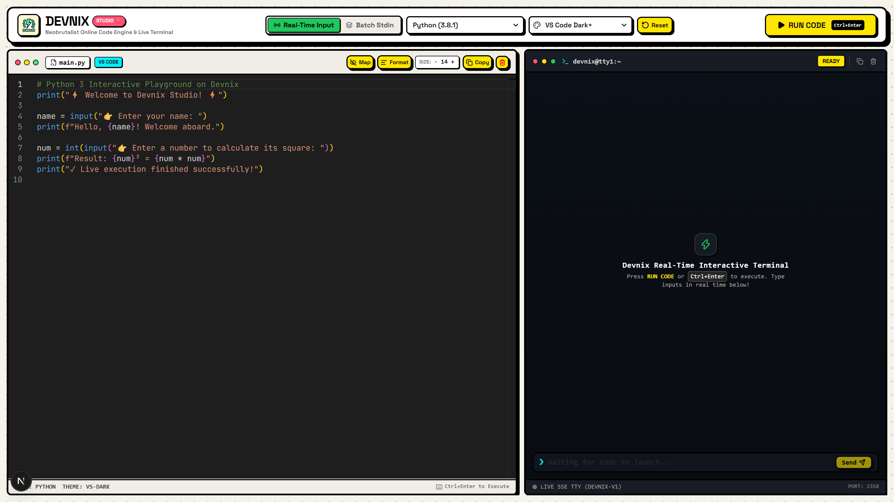

# ⚡ DEVNIX - Online Code Studio

<div align="center">




**A high-performance, multi-language online code execution playground built with Next.js 15, TypeScript, Tailwind CSS, and Judge0 CE.**

[](https://nextjs.org/)
[](https://www.typescriptlang.org/)
[](https://judge0.com/)
[](#-ui-design-features)
[](#-automated-tests)

</div>

---

## 🌟 Overview

**Devnix** is a modern remote code execution engine and playground featuring a high-contrast **Neobrutalism** aesthetic. It provides a split-view IDE layout where developers can write code, pass custom `stdin` inputs, and view real-time compilation, stdout, stderr, execution time, and memory usage.

---

## ✨ Features

- **⚡ Dual Execution Modes (Selectable)**:
  - **🟢 Real-Time Interactive Terminal**: Streams output live in real time using Server-Sent Events (SSE). When your program requests input (`input()`, `cin`), an interactive prompt `❯` appears directly in the terminal where you can type and send values live! Includes a `■ STOP PROCESS` button to terminate long-running processes.
  - **📦 Batch Stdin Mode**: Classic competitive programming mode where test inputs are pre-filled in the `INPUT (STDIN)` tab and executed in batch with time and memory stats.
- **🤖 Context-Aware AI Companion & Multi-Provider Engine**:
  - Integrated right-side AI companion that analyzes active Monaco code, compilation errors, stdin, and stderr.
  - **Universal Provider Support**: Google Gemini, OpenAI, Anthropic Claude, DeepSeek, Groq, Mistral, Ollama (Local), OpenRouter, and Custom OpenAI-Compatible Endpoints.
  - **Direct Endpoint Model Fetching**: Fetches live models directly from provider endpoints without hardcoded lists.
  - **Per-Provider Key & Model Memory**: Saves API keys and chosen models individually per provider in `localStorage`.
  - **Rich Markdown Engine**: Full GitHub-flavored markdown rendering with syntax-highlighted code blocks, tables, callouts, and 1-click **Apply to Monaco Editor**.
- **🧠 Interactive Algorithmic Visualizer & Debugger Tool**:
  - **Step-by-Step Execution Playback**: Play/Pause, Scrubber timeline, speed toggles (0.5x, 1x, 1.5x, 2x), and step forward/backward navigation.
  - **Tactile Array & Moving Pointer Lanes**: Visual array blocks with index tags and animated multi-color pointer badges (`▲ left`, `▲ right`, `▲ mid`, `▲ i`, `▲ j`) that slide under active elements.
  - **Live Hash Map / Set Lookup Tables**: Renders key-value cards with real-time insertion and lookup highlighting.
  - **Stack & Queue Visualizer**: Visualizes LIFO / FIFO structures with `[BOTTOM / FRONT]` and `[TOP / BACK]` indicators.
  - **Synchronized Monaco Line Glow**: Synchronously scrolls and highlights the executing line in glowing yellow with gutter markers in Monaco Editor.
  - **Smart Condensed Stepping**: Automatically condenses long loops (e.g. 500 iterations) into 5 to 8 key representative steps grounded in user inputs.
- **↔️ Draggable & Resizable Workspace**:
  - **Editor & Terminal Split Resizer**: Tactile center divider with grip pill for horizontal resizing between Code Editor and Terminal (25% to 75% limits with auto Monaco layout recalculation).
  - **AI Companion Panel Resizer**: Left-border drag handle to resize the AI drawer (380px to 850px constraints with localStorage memory).
- **🎨 Neobrutalist Design System**: Bold black borders, vibrant pop colors (neon yellow, electric cyan, coral pink), and tactile drop-shadow interactions.
- **💻 VS Code Monaco Editor Engine**: Powered by the official Monaco editor that powers Visual Studio Code with IntelliSense autocomplete, bracket pair colorization, smooth cursor animation, auto-closing brackets, and format document.
- **🎭 7+ Editor Themes**:
  - `VS Code Dark+` (Classic dark)
  - `VS Code Light+` (Clean light)
  - `High Contrast Dark` & `High Contrast Light`
  - `⚡ Devnix Cyberpunk` (Custom high-contrast neon theme)
  - `🎨 Monokai Pro`
  - `❄️ Nord Arctic`
- **🌐 11+ Supported Languages**:
  - Python (3.12+)
  - JavaScript (Node.js 20+)
  - TypeScript (5.x)
  - C++ (GCC 13+)
  - C (GCC 13+)
  - Java (OpenJDK 21+)
  - Rust (1.78+)
  - Go (1.22+)
  - Ruby (3.2+)
  - PHP (8.2+)
  - Bash (5.2+)
- **👥 User Authentication & Admin Management**:
  - Secure JWT authentication with HTTP-only cookie tokens and auto-refresh.
  - Profile customization and password management.
  - Admin Panel with user controls, self-signup toggle, and administrative user impersonation.
- **⚡ Dual Execution Architecture**:
  - **Production Mode**: Communicates with sandboxed **Judge0 CE** containers running on Docker.
  - **Local Development Mode**: Built-in intelligent hybrid fallback runner for instant cross-platform testing (Windows, macOS, Linux) with full UTF-8 emoji support.
- **⌨️ Developer-First UX**:
  - `Ctrl + Enter` / `Cmd + Enter` instant run shortcut.
  - Custom `Tab` handling (4-space indentation without losing focus).
  - Dynamic font size scaler (`+` / `-`).
  - Stdin input console for interactive programs (`input()`, `cin`).
  - Status badges (`ACCEPTED`, `TIME LIMIT EXCEEDED`, `COMPILATION ERROR`, `RUNTIME ERROR`).
  - One-click copy code, reset boilerplates, and clear output.

---

## 📂 Project Structure

```
Devnix/
├── docs/
│   └── devnix_preview.png       # UI preview screenshot
├── judge0/                      # Backend Code Execution Engine
│   ├── docker-compose.yml       # Server, Worker, Redis, and Postgres services
│   ├── judge0.conf              # Judge0 resource & timeout configurations
│   ├── test_submission.ps1      # Direct PowerShell API test script
│   └── README.md                # Dedicated Judge0 documentation
├── web/                         # Next.js Frontend Application
│   ├── src/
│   │   ├── app/
│   │   │   ├── api/execute/     # Hybrid execution API route
│   │   │   ├── globals.css      # Neobrutalism design system tokens
│   │   │   ├── layout.tsx       # Root layout with custom typography
│   │   │   └── page.tsx         # Main interactive Code Studio interface
│   │   └── lib/
│   │       └── languages.ts     # Language definitions, IDs & boilerplates
│   ├── test_suite.mjs           # Automated end-to-end multi-language test suite
│   ├── package.json
│   └── tsconfig.json
├── .gitignore                   # Clean global repository ignore rules
└── README.md                    # Project documentation
```

---

## 🚀 Getting Started (Local Setup)

### Prerequisites

- **Node.js** (v18.0.0 or higher)
- **npm** (v9+ or higher)
- **Docker Desktop** *(Optional: if self-hosting the Judge0 Docker cluster locally)*

---

### Step 1: Clone the Repository

```bash
git clone https://github.com/your-username/Devnix.git
cd Devnix
```

---

### 🐳 Quick Start (One Command Multi-Arch Docker Compose)

Devnix includes smart multi-architecture support that runs natively on **both ARM64 (Oracle, AWS Graviton, Apple Silicon, Raspberry Pi)** and **x86_64 / AMD64 (Intel & AMD)**:

**On Linux / macOS:**
```bash
chmod +x ./start.sh
./start.sh
```

**On Windows (PowerShell):**
```powershell
.\start.ps1
```

Or start directly with Docker Compose:
- **Universal Mode (ARM64 & x86_64)**:
  ```bash
  docker compose up -d
  ```
- **Full Stack Mode with Judge0 (x86_64 only)**:
  ```bash
  docker compose --profile full up -d
  ```

- **Devnix Web Studio**: `http://localhost:3000`

To view logs:
```bash
docker compose logs -f
```

To stop all services:
```bash
docker compose down
```

---

### 💻 Local Development Setup (Without Docker)

If you are developing the frontend locally using Node.js:

1. Navigate to the `web` directory and install dependencies:
   ```bash
   cd web
   npm install
   ```

2. Start the development server:
   ```bash
   npm run dev
   ```

3. Open **[http://localhost:3000](http://localhost:3000)** in your browser.

---

## 🧪 Automated Tests

Devnix includes an automated end-to-end test suite that verifies code compilation and execution across all 11 supported languages.

Run the test suite inside the `web` folder:

```bash
npm test
```

### Test Output:

```text
=======================================================
⚡ DEVNIX FULL COMPREHENSIVE LANGUAGE TEST SUITE ⚡
=======================================================

Testing [Python                  ] (ID: 71) ... ✅ PASSED (0.046s)
   └─ Stdout: Hello, Developer! Welcome to Devnix ⚡
Testing [JavaScript (Node.js)    ] (ID: 63) ... ✅ PASSED (0.070s)
   └─ Stdout: ⚡ JavaScript Execution on Devnix
Testing [TypeScript              ] (ID: 74) ... ✅ PASSED (0.099s)
   └─ Stdout: ⚡ TypeScript on Devnix
Testing [C++ (GCC)               ] (ID: 54) ... ✅ PASSED (0.018s)
   └─ Stdout: === Devnix C++ Sandbox Output ===
Testing [C (GCC)                 ] (ID: 50) ... ✅ PASSED (0.018s)
   └─ Stdout: === Devnix C Sandbox Output ===
Testing [Java (OpenJDK)          ] (ID: 62) ... ✅ PASSED (0.042s)
   └─ Stdout: ⚡ Hello from Java on Devnix! ⚡
Testing [Rust                    ] (ID: 73) ... ✅ PASSED (0.024s)
   └─ Stdout: ⚡ Devnix Rust Execution ⚡
Testing [Go                      ] (ID: 60) ... ✅ PASSED (0.035s)
   └─ Stdout: ⚡ Hello from Go on Devnix! ⚡
Testing [Ruby                    ] (ID: 72) ... ✅ PASSED (0.028s)
   └─ Stdout: ⚡ Devnix Ruby Runner
Testing [PHP                     ] (ID: 68) ... ✅ PASSED (0.015s)
   └─ Stdout: ⚡ Devnix PHP Execution Engine
Testing [Bash                    ] (ID: 46) ... ✅ PASSED (0.054s)
   └─ Stdout: ⚡ Bash on Devnix

=======================================================
RESULT: 11 PASSED, 0 FAILED (TOTAL: 11 LANGUAGES)
=======================================================
```

---

## ⌨️ Keyboard Shortcuts

| Shortcut | Action |
| :--- | :--- |
| <kbd>Ctrl</kbd> + <kbd>Enter</kbd> | **Run Code** immediately |
| <kbd>Tab</kbd> | Insert **4 spaces** indentation |
| <kbd>Esc</kbd> | Unfocus editor |

---

---

## 🤝 Collaborator & Contributing Guide

We welcome contributions of all kinds! Whether you want to add support for a **new programming language**, improve the **real-time terminal engine**, design a **new Neobrutalism theme**, or fix a bug — here is how to get started:

### 🛠️ Development Workflow

1. **Fork & Clone**:
   ```bash
   git clone https://github.com/Karthikjl/Devnix.git
   cd Devnix
   ```

2. **Create a Feature Branch**:
   ```bash
   git checkout -b feature/your-feature-name
   # or for bug fixes:
   git checkout -b fix/issue-description
   ```

3. **Install Dependencies**:
   ```bash
   cd web
   npm install
   ```

4. **Start the Dev Server**:
   ```bash
   npm run dev
   ```

5. **Run the Test Suite Before Pushing**:
   ```bash
   npm test
   npm run build
   ```

---

### ➕ How to Add a New Programming Language

Adding a new language takes just **3 simple steps**:

1. **Register Language in Config**:
   Open [`web/src/lib/languages.ts`](./web/src/lib/languages.ts) and append your language to `SUPPORTED_LANGUAGES`:
   ```typescript
   {
     id: 80, // Official Judge0 Language ID
     name: "r",
     label: "R (GCC)",
     version: "4.0.0",
     extension: "r",
     monacoLang: "r", // Monaco language identifier
     badgeColor: "#22c55e",
     defaultCode: `print("Hello from R on Devnix!")\n`
   }
   ```

2. **Add Execution Handling**:
   - For **Batch Runner**: Add case in [`web/src/app/api/execute/route.ts`](./web/src/app/api/execute/route.ts).
   - For **Real-Time Terminal Streaming**: Add case in [`web/src/lib/sessionManager.ts`](./web/src/lib/sessionManager.ts).

3. **Add Test Case & Verify**:
   Add test snippet in [`web/test_suite.mjs`](./web/test_suite.mjs) and verify:
   ```bash
   npm test
   ```

---

### 🎨 How to Add New VS Code Themes

Monaco Editor themes are configured in [`web/src/app/page.tsx`](./web/src/app/page.tsx):
1. Add your theme definition inside `handleEditorWillMount` with `monaco.editor.defineTheme('your-theme-name', { ... })`.
2. Add your theme object to `THEMES` array:
   ```typescript
   { id: "your-theme-name", name: "✨ Your Theme Title" }
   ```

---

### 📐 Neobrutalism Design Guidelines

When adding or modifying UI components, ensure you adhere to the **Devnix Neobrutalism Design System**:
- **Borders**: Heavy solid black outlines (`border-2` or `border-[3px] border-black`).
- **Drop Shadows**: Sharp, unblurred directional drop shadows (`shadow-[3px_3px_0px_#000]` or `shadow-[4px_4px_0px_#000]`).
- **Interactive States**: Translate down on active press (`active:translate-x-[1.5px] active:translate-y-[1.5px] active:shadow-[1px_1px_0px_#000]`).
- **Color Palette**: Use vibrant, high-contrast accents (Neon Yellow `#FFE600`, Electric Cyan `#00F0FF`, Lime Green `#22C55E`, Coral Pink `#FF5277`, Lavender `#C084FC`).

---

### 📥 Submitting Pull Requests

1. Commit your changes with clear, descriptive commit messages:
   ```bash
   git commit -m "feat(languages): add Kotlin support with starter boilerplate"
   ```
2. Push to your branch:
   ```bash
   git push origin feature/your-feature-name
   ```
3. Open a **Pull Request (PR)** on GitHub with:
   - Summary of changes and why they are needed.
   - Confirmation that `npm test` and `npm run build` passed.
   - Screenshot / video if any UI modifications were made (use `npm run screenshot` to capture!).

---

## 📄 License

This project is open source and available under the **MIT License**.

