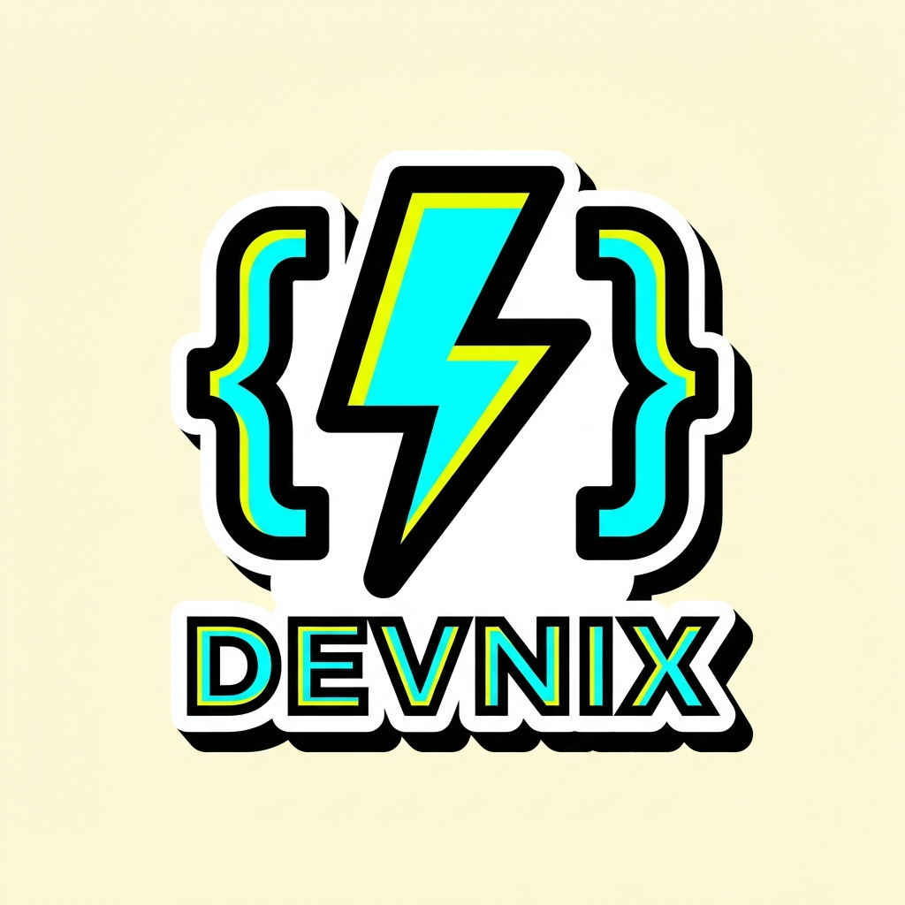

# ⚡ DEVNIX — Neobrutalist Online Code Studio & Judge

<div align="center">




**A high-performance, multi-language online code execution playground built with Next.js 15, TypeScript, Tailwind CSS, and Judge0 CE.**

[](https://nextjs.org/)
[](https://www.typescriptlang.org/)
[](https://judge0.com/)
[](#-ui-design-features)
[](#-automated-tests)

</div>

---

## 🌟 Overview

**Devnix** is a modern remote code execution engine and playground featuring a high-contrast **Neobrutalism** aesthetic. It provides a split-view IDE layout where developers can write code, pass custom `stdin` inputs, and view real-time compilation, stdout, stderr, execution time, and memory usage.

---

## ✨ Features

- **⚡ Dual Execution Modes (Selectable)**:
  - **🟢 Real-Time Interactive Terminal**: Streams output live in real time using Server-Sent Events (SSE). When your program requests input (`input()`, `cin`), an interactive prompt `❯` appears directly in the terminal where you can type and send values live! Includes a `■ STOP PROCESS` button to terminate long-running processes.
  - **📦 Batch Stdin Mode**: Classic competitive programming mode where test inputs are pre-filled in the `INPUT (STDIN)` tab and executed in batch with time and memory stats.
- **🎨 Neobrutalist Design System**: Bold black borders, vibrant pop colors (neon yellow, electric cyan, coral pink), and tactile drop-shadow interactions.
- **💻 VS Code Monaco Editor Engine**: Powered by the official Monaco editor that powers Visual Studio Code with IntelliSense autocomplete, bracket pair colorization, smooth cursor animation, auto-closing brackets, and format document.
- **🎭 7+ Editor Themes**:
  - `VS Code Dark+` (Classic dark)
  - `VS Code Light+` (Clean light)
  - `High Contrast Dark` & `High Contrast Light`
  - `⚡ Devnix Cyberpunk` (Custom high-contrast neon theme)
  - `🎨 Monokai Pro`
  - `❄️ Nord Arctic`
- **🌐 11+ Supported Languages**:
  - Python 3.8+
  - JavaScript (Node.js)
  - TypeScript
  - C++ (GCC)
  - C (GCC)
  - Java (OpenJDK)
  - Rust
  - Go
  - Ruby
  - PHP
  - Bash
- **⚡ Dual Execution Architecture**:
  - **Production Mode**: Communicates with sandboxed **Judge0 CE** containers running on Docker.
  - **Local Development Mode**: Built-in intelligent hybrid fallback runner for instant cross-platform testing (Windows, macOS, Linux) with full UTF-8 emoji support.
- **⌨️ Developer-First UX**:
  - `Ctrl + Enter` / `Cmd + Enter` instant run shortcut.
  - Custom `Tab` handling (4-space indentation without losing focus).
  - Dynamic font size scaler (`+` / `-`).
  - Stdin input console for interactive programs (`input()`, `cin`).
  - Status badges (`ACCEPTED`, `TIME LIMIT EXCEEDED`, `COMPILATION ERROR`, `RUNTIME ERROR`).
  - One-click copy code, reset boilerplates, and clear output.

---

## 📂 Project Structure

```
Devnix/
├── docs/
│   └── devnix_preview.png       # UI preview screenshot
├── judge0/                      # Backend Code Execution Engine
│   ├── docker-compose.yml       # Server, Worker, Redis, and Postgres services
│   ├── judge0.conf              # Judge0 resource & timeout configurations
│   ├── test_submission.ps1      # Direct PowerShell API test script
│   └── README.md                # Dedicated Judge0 documentation
├── web/                         # Next.js Frontend Application
│   ├── src/
│   │   ├── app/
│   │   │   ├── api/execute/     # Hybrid execution API route
│   │   │   ├── globals.css      # Neobrutalism design system tokens
│   │   │   ├── layout.tsx       # Root layout with custom typography
│   │   │   └── page.tsx         # Main interactive Code Studio interface
│   │   └── lib/
│   │       └── languages.ts     # Language definitions, IDs & boilerplates
│   ├── test_suite.mjs           # Automated end-to-end multi-language test suite
│   ├── package.json
│   └── tsconfig.json
├── .gitignore                   # Clean global repository ignore rules
└── README.md                    # Project documentation
```

---

## 🚀 Getting Started (Local Setup)

### Prerequisites

- **Node.js** (v18.0.0 or higher)
- **npm** (v9+ or higher)
- **Docker Desktop** *(Optional: if self-hosting the Judge0 Docker cluster locally)*

---

### Step 1: Clone the Repository

```bash
git clone https://github.com/your-username/Devnix.git
cd Devnix
```

---

### Step 2: (Optional) Start the Judge0 Docker Cluster

To start the local Judge0 Community Edition instance (Server, Worker, Redis, and PostgreSQL):

```bash
cd judge0
docker compose up -d
cd ..
```

*Judge0 REST API will be active at `http://localhost:2358`.*

---

### Step 3: Install & Start the Web Application

Navigate to the `web` directory and install dependencies:

```bash
cd web
npm install
```

Start the Next.js development server:

```bash
npm run dev
```

Open **[http://localhost:3000](http://localhost:3000)** in your web browser.

---

## 🧪 Automated Tests

Devnix includes an automated end-to-end test suite that verifies code compilation and execution across all 11 supported languages.

Run the test suite inside the `web` folder:

```bash
npm test
```

### Test Output:

```text
=======================================================
⚡ DEVNIX FULL COMPREHENSIVE LANGUAGE TEST SUITE ⚡
=======================================================

Testing [Python                  ] (ID: 71) ... ✅ PASSED (0.046s)
   └─ Stdout: Hello, Developer! Welcome to Devnix ⚡
Testing [JavaScript (Node.js)    ] (ID: 63) ... ✅ PASSED (0.070s)
   └─ Stdout: ⚡ JavaScript Execution on Devnix
Testing [TypeScript              ] (ID: 74) ... ✅ PASSED (0.099s)
   └─ Stdout: ⚡ TypeScript on Devnix
Testing [C++ (GCC)               ] (ID: 54) ... ✅ PASSED (0.018s)
   └─ Stdout: === Devnix C++ Sandbox Output ===
Testing [C (GCC)                 ] (ID: 50) ... ✅ PASSED (0.018s)
   └─ Stdout: === Devnix C Sandbox Output ===
Testing [Java (OpenJDK)          ] (ID: 62) ... ✅ PASSED (0.042s)
   └─ Stdout: ⚡ Hello from Java on Devnix! ⚡
Testing [Rust                    ] (ID: 73) ... ✅ PASSED (0.024s)
   └─ Stdout: ⚡ Devnix Rust Execution ⚡
Testing [Go                      ] (ID: 60) ... ✅ PASSED (0.035s)
   └─ Stdout: ⚡ Hello from Go on Devnix! ⚡
Testing [Ruby                    ] (ID: 72) ... ✅ PASSED (0.028s)
   └─ Stdout: ⚡ Devnix Ruby Runner
Testing [PHP                     ] (ID: 68) ... ✅ PASSED (0.015s)
   └─ Stdout: ⚡ Devnix PHP Execution Engine
Testing [Bash                    ] (ID: 46) ... ✅ PASSED (0.054s)
   └─ Stdout: ⚡ Bash on Devnix

=======================================================
RESULT: 11 PASSED, 0 FAILED (TOTAL: 11 LANGUAGES)
=======================================================
```

---

## ⌨️ Keyboard Shortcuts

| Shortcut | Action |
| :--- | :--- |
| <kbd>Ctrl</kbd> + <kbd>Enter</kbd> | **Run Code** immediately |
| <kbd>Tab</kbd> | Insert **4 spaces** indentation |
| <kbd>Esc</kbd> | Unfocus editor |

---

## 🚢 Building for Production

To create an optimized production build:

```bash
cd web
npm run build
npm run start
```

---

## 📄 License

This project is open source and available under the **MIT License**.
